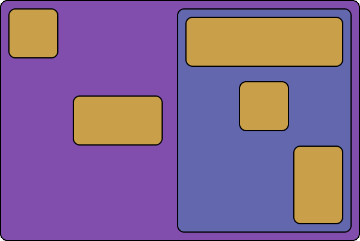

# react-flex-element

[](https://www.npmjs.com/package/react-flex-element)
[](https://www.npmjs.com/package/typescript)
[](https://www.npmjs.com/package/react)

[Flexbox](https://developer.mozilla.org/en-US/docs/Web/CSS/CSS_Flexible_Box_Layout/Basic_Concepts_of_Flexbox) elements for React.



```jsx
<Flex row spaceBetween>
  <FlexItem selfStart ... />
  <FlexItem shrink grow ... />
  <Flex
    selfStretch
    column
    spaceBetween
    alignEnd
    grow={2}
  >
    <FlexItem selfStretch ... />
    <FlexItem selfCenter ... />
    <FlexItem grow ... />
  </Flex>
</Flex>
```

## Tl;dr

You don't know CSS Flexbox? Read [here](https://developer.mozilla.org/en-US/docs/Web/CSS/CSS_Flexible_Box_Layout/Basic_Concepts_of_Flexbox)!

2 components:
- `<Flex />`
  - creates a flex container.
  - provides **EVERY** Flexbox property.
- `<FlexItem />`
  - creates a flexed item.
  - provides Flexbox properties for items only.

3 ways to set properties:
- flags (`row`, `start`, `stretch`, ecc...)
- short version (`justify`, `align`, `self`, ecc...)
- classic (`displayProperty`, `flexDirectionProperty`, `justifyContentProperty`, ecc...)

## Install

```shell
# Install via NPM
npm i react-flex-element
# or Yarn
yarn add react-flex-element
```

## Usage

Every Flexbox properties can be set via one or more dedicated props.

### Flexible "container" props

This first set of props refers to "flex container" related properties.
For this reason they are only available for the component `Flex`.

#### displayProperty

| props | type | value |
| --- | --- | --- |
| / | / | `flex` (default) |
| `inline` | `boolean` | `inline-flex` |
| `displayProperty` | `string` | any |

```jsx
<Flex /> // flex
<Flex inline /> // inline-flex
<Flex displayProperty="inline-flex"/> // inline-flex
```

#### flex-direction

| props | type | value |
| --- | --- | --- |
| `row` | `boolean` | `row` (default) |
| `col`, `column` | `boolean` | `column` |
| `rowReverse` | `boolean` | `row-reverse` |
| `colReverse`, `columnReverse` | `boolean` | `column-reverse` |
| `direction`, `flexDirectionProperty` | `string` | any |

```jsx
<Flex row /> // row
<Flex col /> // column
<Flex column /> // column
<Flex rowReverse /> // row-reverse
<Flex colReverse /> // column-reverse
<Flex columnReverse /> // column-reverse

<Flex direction="column-reverse" /> // column-reverse
<Flex flexDirectionProperty="column-reverse" /> // column-reverse
```

The additional `reverse` prop can be used to programmatically revert the specified direction:

| prop | type |
| --- | --- |
| `reverse` | `boolean` |

```jsx
<Flex row reverse /> // row-reverse
<Flex row reverse={true} /> // row-reverse
<Flex row reverse={false} /> // row
```

#### flex-wrap

| props | type | value |
| --- | --- | --- |
| `nowrap` | `boolean` | `nowrap` (default) |
| `wrap` | `boolean` | `wrap` |
| `wrapReverse` | `boolean` | `wrap-reverse` |
| `wrap`, `flexWrapProperty` | `string` | any |

```jsx
<Flex wrap /> // wrap
<Flex nowrap /> // nowrap
<Flex wrapReverse /> // wrap-reverse

<Flex wrap={true} /> // wrap
<Flex wrap={false} /> // nowrap

<Flex wrap="wrap-reverse" /> // wrap-reverse
<Flex flexWrapProperty="wrap-reverse" /> // wrap-reverse
```

#### justify-content

| props | type | value |
| --- | --- | --- |
| `start` | `boolean` | `flex-start` (default) |
| `end` | `boolean` | `flex-end` |
| `center` | `boolean` | `center` |
| `spaceBetween` | `boolean` | `space-between` |
| `spaceAround` | `boolean` | `space-around` |
| `spaceEvenly` | `boolean` | `space-evenly` |
| `justify`, `justifyContentProperty` | `string` | any |

```jsx
<Flex start /> // flex-start
<Flex end /> // flex-end
<Flex center /> // center
<Flex spaceBetween /> // space-between
<Flex spaceAround /> // space-around
<Flex spaceEvenly /> // space-evenly

<Flex justify="space-beetween" /> // space-beetween
<Flex justifyContentProperty="space-beetween" /> // space-beetween
```

#### align-items

| props | type | value |
| --- | --- | --- |
| `alignStart` | `boolean` | `flex-start` |
| `alignEnd` | `boolean` | `flex-end` |
| `alignCenter` | `boolean` | `center` (default) |
| `stretch`, `alignStretch` | `boolean` | `stretch` |
| `baseline`, `alignBaseline` | `boolean` | `baseline` |
| `align`, `alignItemsProperty` | `string` | any |

```jsx
<Flex alignStart /> // flex-start
<Flex alignEnd /> // flex-end
<Flex alignCenter /> // center
<Flex alignStretch /> // stretch
<Flex alignBaseline /> // baseline

<Flex align="flex-end" /> // flex-end
<Flex alignItemsProperty="flex-end" /> // flex-end
```

#### align-content

| props | type | value |
| --- | --- | --- |
| `contentStart` | `boolean` | `flex-start` |
| `contentEnd` | `boolean` | `flex-end` |
| `contentCenter` | `boolean` | `center` |
| `contentStretch` | `boolean` | `stretch` |
| `contentBaseline` | `boolean` | `baseline` |
| `alignContentProperty` | `string` | any |

```jsx
<Flex contentStart /> // flex-start
<Flex contentEnd /> // flex-end
<Flex contentCenter /> // center
<Flex contentStretch /> // stretch
<Flex contentSpaceBetween /> // space-between
<Flex contentSpaceAround /> // space-around

<Flex alignContentProperty="flex-end" /> // flex-end
```

#### row-gap

| props | type | value |
| --- | --- | --- |
| `rowGap` | `number`, `string` | any |

```jsx
<Flex rowGap={10} /> // 10px
<Flex rowGap="10px" /> // 10px
```

#### column-gap

| props | type | value |
| --- | --- | --- |
| `colGap`, `columnGap` | `number`, `string` | any |

```jsx
<Flex colGap={10} /> // 10px
<Flex colGap="10px" /> // 10px
<Flex columnGap={10} /> // 10px
<Flex columnGap="10px" /> // 10px
```

#### gap

| props | type | value |
| --- | --- | --- |
| `gap` | `number`, `string`, `Array` | any |

```jsx
<Flex gap={10} /> // 10px
<Flex gap="10px" /> // 10px

<Flex gap={[10, 20]} /> // 10px 20px
<Flex gap="10px 20px" /> // 10px 20px
```

### Flexible "item" props

The set of props below refers to "flex items" related properties.
They are all available for both `Flex` and `FlexItem` components.

#### orderProperty

| props | type | value |
| --- | --- | --- |
| `orderProperty` | `number`, `string` | any |

```jsx
<Flex orderProperty={3} /> // 3
<Flex orderProperty="3" /> // 3
```

#### flex-grow

| props | type | value |
| --- | --- | --- |
| `grow`, `flexGrow` | `booolean, number, string` | / |

```jsx
<Flex grow /> // 1
<Flex grow={true} /> // 1
<Flex grow={false} /> // 0
<Flex grow={3} /> // 3
<Flex grow="3" /> // 3
<Flex flexGrow={3} /> // 3
<Flex flexGrow="3" /> // 3
```

#### flex-shrink

| props | type | value |
| --- | --- | --- |
| `shrink`, `flexShrink` | `booolean, number, string` | / |

```jsx
<Flex shrink /> // 1
<Flex shrink={true} /> // 1
<Flex shrink={false} /> // 0
<Flex shrink={3} /> // 3
<Flex shrink="3" /> // 3
<Flex flexShrink={3} /> // 3
<Flex flexShrink="3" /> // 3
```

#### flex-basis

| props | type | value |
| --- | --- | --- |
| `basis`, `flexBasis` | `number, string` | / |

```jsx
<Flex basis={10} /> // 10px
<Flex basis="10px" /> // 10px
<Flex flexBasis={10} /> // 10px
<Flex flexBasis="10px" /> // 10px
```

#### align-self

| props | type | value |
| --- | --- | --- |
| `selfStart` | `boolean` | `flex-start` |
| `selfEnd` | `boolean` | `flex-end` |
| `selfCenter` | `boolean` | `center` |
| `selfStretch` | `boolean` | `stretch` |
| `selfBaseline` | `boolean` | `baseline` |
| `self`, `alignSelfProperty` | `string` | / |

```jsx
<Flex selfStart /> // flex-start
<Flex selfEnd /> // flex-end
<Flex selfCenter /> // center
<Flex selfStretch /> // stretch
<Flex selfBaseline /> // baseline

<Flex self="flex-end" /> // flex-end
<Flex alignSelfProperty="flex-end" /> // flex-end
```

### Other props

By default, both `Flex` and `FlexItem` components renders a `div` element
with the specified flex properties.

Nevertheless, it is possible to change this behaviour via the `as` prop:

| props | type |
| --- | --- |
| `as` | `string`, `React.ComponentType` |

Changes the rendered element.

```jsx
<Flex as="input" />
<Flex as={MyCustomComp} />
```

In addition, any additional prop passed to `Flex` or `FlexItem` will be drilled
down to the render element or component.

#### Usage with a custom element

```jsx
<FlexItem
  as="input"
  href="#foo"
  selfEnd
  grow={3}
/>
```

#### Usage with a custom component

```jsx
const MyComp = ({ size }) => (
  <span style={{ fontSize: size }}>
    {children}
  </span>
)
```
```jsx
<FlexItem
  as={MyComp}
  size={18}
  selfEnd
  grow={3}
/>
```


## Components

### Flex

Use it to create a flexible container.

```jsx
<Flex>Hello world!</Flex>
```

By default, it renders a `div` element with the following CSS properties set:
```css
displayProperty: flex;
align-items: center;
```

It provides all the properties listed above.

### FlexItem

Use it to create a flexible item.

```jsx
// React
<FlexItem>Hello world!</FlexItem>
```

By default, it renders a `div` element, but it does not set any CSS property.

Lastly, it provides only props related to `orderProperty`, `flex-grow`, `flex-shrink`,
`flex-basis` and `align-self` properties.
